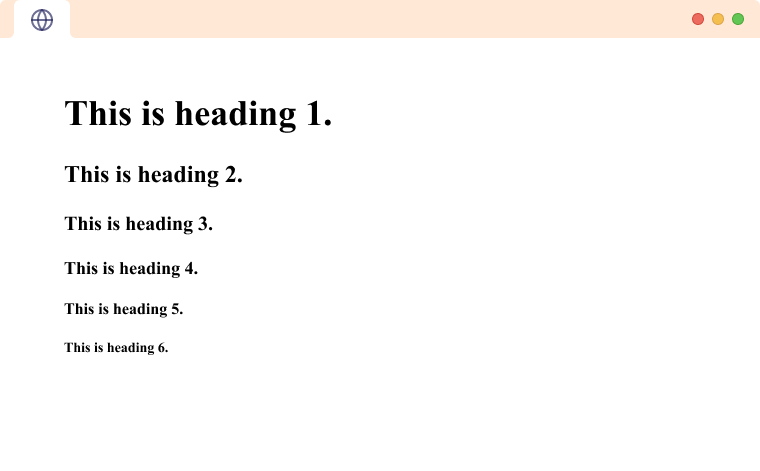

# Grønn nivå

## Halo, jeg heter Mykyta

### Om meg:

Jeg er __18__ år gammel. Hobbyene mine er _gitar_, _gaming_ og _programmering_. Jeg planlegger å få plass i en lærebedrift. Jeg har noen små prosjekter som er skrevet i __Python__. Du kan se koden min på [GitHub](www.github.com) (eksempel lenken).

### Mål for skoleåret:

1. Lære å forstå PC-komponenter.
2. Lære programmering over basis-/mellomniva. 
3. Få praksis.

> "The best way to predict the future is to invent it."
> 
> – Alan Kay

---
HTML-koden `<h1>` betyr en overskrift. Det finnes 6 forskjellige overskrifter. For eksempel: `<h3>`, osv.

---

# Gul nivå

| Språk | Styrke | Svakhet |
| :--- | :--- | :--- |
| Python | Enkel | Treg |
| C++ | Rask | Komplisert |
| JavaScript | Fleksibel | Rotete |

---

- [] Lære Python.
- [] Lage et spill.
- [x] Skrive en sang.
- [x] Betale for Spotify.

---

# MINI-README

## MyAwesomeGame

Dette er et kult 2D-spill laget med Python og Pygame. Perfekt for gamers som liker retro-style!

## Installation

1. Last ned koden til PC-en din.
2. Installer Pygame ved å skrive `pip install pygame` i terminalen.
3. Start spillet ved å kjøre `python main.py`.

## Functions

- Flere spennende nivåer.
- Kul bakgrunnsmusikk med gitarlyder.
- Lagring av highscore.

---

\*Dette er en vanlig stjerne og blir ikke kursiv*

\_Dette er en vanlig understrek_

  
blahblahblahblah

  Hvordan man sier __hei__ på norsk:
  * Heisann
  * Hallo

